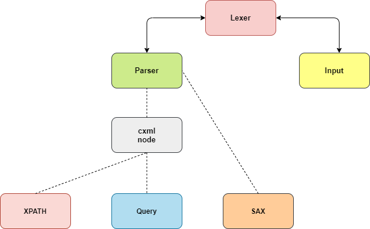
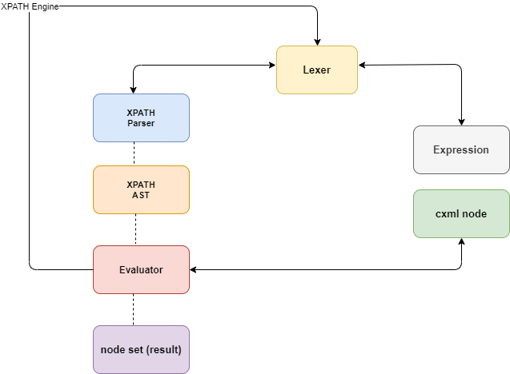

## The cxml Architecture

This page provides a quick glimpse into the project's current implementation system and design approach.  

Below is an overview of the entire archictecture:
 

 

The parser is flexible and stand-alone, and would parse xml documents into a single (root) node, freeing itself automatically when done. 

This leaves all nodes created (during parsing) to the responsibility of the user for deallocation.

Luckily the parser exposes some node-freeing-functions (`cxml_*_node_free`/`cxml_free_*_node`) via `cxdefs.c` which makes freeing really easy.

The root node produced from the parser can be served to the XPATH engine, which would perform XPATH queries on it, and also the Query API which provides several convenience functions for interacting with the parsed data.

However, the SAX (Simple API for XML) interface due to its nature, cannot utilize the beautiful parser, but relies on a customized stream-based parser which utilizes parts and pieces of the original DOM parser.

## XPATH
This works with the DOM based parser. It can be used with the XML document that's been parsed by the parser. 
The XPATH engine satisfies a good subset of the xpath 1.0 specification, which is quite powerful. The engine receives an XPATH query string and a cxml node object, as input and produces a node set, as its output/result.

XPATH features not supported includes:
- Unabbreviated axis names (for example `self::foo`)
- Some core XPATH functions (might be added later)
- Normalization of attribute values
- Normalization of namespace URIs.

Bonus features supported includes:
- Comments (from xpath 2.0)
- Wildcard in prefix names of nametests (for example `//*:element | //@*:foo`) (also from xpath 2.0)

## Query
The Query interface provides useful functions and a custom simple DSL for manipulating the (parsed) xml document and can be very useful to users with little to no XPATH knowledge. Along with that, the query interface can be used in tandem with the XPATH interface making both a powerful combination.

## SAX
Simple API for XML, is an interface for working with heavy/large xml files. cxml's SAX interface is "simple" and intuitive enough to work with, solely "event-driven" but with zero callbacks and absolutely no callback hell. In fact, the SAX parser works more like a StAX parser. 
Currently, the implementation is still quite slow, and will only be faster than the DOM-based interfaces (XPATH/Query) when the files get too large.

## Operations
* XPATH:    
    - primary operation: Selection
      -   enables selection of any kind of node, wherever they are in the document. 
          It can also be used to select nodes, based on some complex logic. It does not allow deletion or update however.

* SAX: 
    - primary operation: Selection
      - selects nodes only requested by users, and as they are encountered in the document.

* Query: 
    - primary operation: Creation, Selection, Update, Deletion
        - The query DSL itself is very small and limited, and can only perform (element) selection operations.  
        - It allows selection of (element) nodes anywhere in the document.
        - The query api (a wrapper around the query DSL) however, exposes some set of functions that enables selection, creation, update, and deletion of cxml nodes. These functions can also be employed in creating XML documents programmatically.
